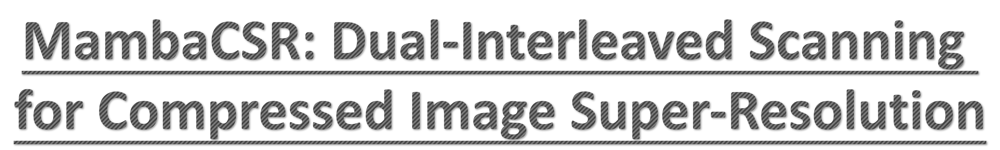
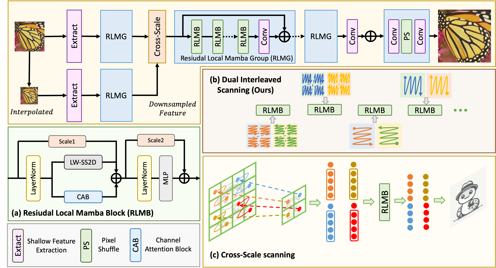
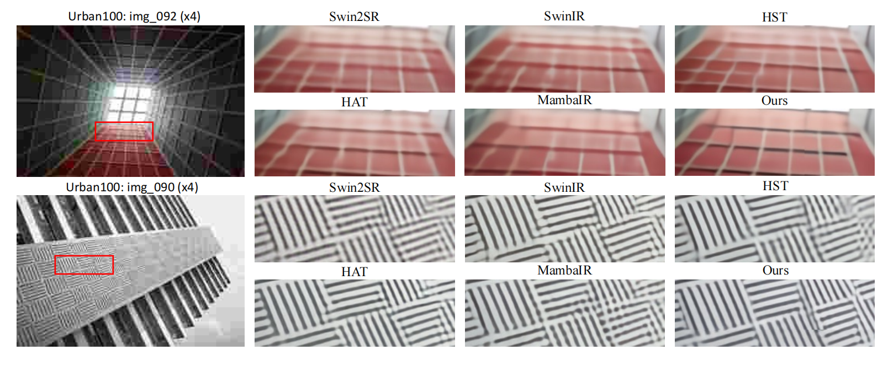
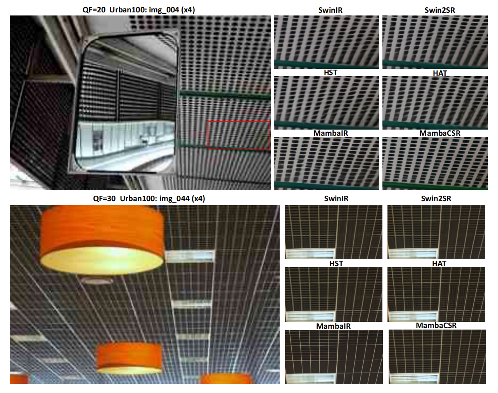

<p align="center">
  
</p>

# MambaCSR: Dual-Interleaved Scanning for Compressed Image Super-Resolution With SSMs

[](https://arxiv.org/abs/2408.11758)  []()  

This repository is the official PyTorch implementation of MambaCSR.

## :bookmark: News!!!
- [x] 2024-08-22: **Arxiv version has been released.**
- [x] 2024-09-19: **Updated training and test codes (Release two weights for QF_10) .**

> We present MambaCSR, a simple but effective framework based on Mamba for the challenging compressed image super-resolution (CSR) task. Particularly, the scanning strategies of Mamba are crucial for effective contextual knowledge modeling in the restoration process despite it relying on selective state space modeling for all tokens. In this work, we propose an efficient dual-interleaved scanning paradigm (DIS) for CSR, which is composed of two scanning strategies: (i) hierarchical interleaved scanning is designed to comprehensively capture and utilize the most potential contextual information within an image by simultaneously taking advantage of the local window-based and sequential scanning methods; (ii) horizontal-to-vertical interleaved scanning is proposed to reduce the computational cost by leaving the redundancy between the scanning of different directions. To overcome the non-uniform compression artifacts, we also propose position-aligned cross-scale scanning to model multi-scale contextual information. Experimental results on multiple benchmarks have shown the great performance of our MambaCSR in the compressed image super-resolution task. 

<p align="center">
  
</p>

## :sparkles: Getting Start

### Prepare environment

## <a name="installation"></a> Environment Installation

The CUDA driver must be higher than 11.6 (We use 11.8 in MambaCSR)

- Ubuntu 20.04
- CUDA 11.8
- Python 3.9
- PyTorch 2.1.1 + cu118

1: First install Pytorch (2.1.1+cu118) as following command:

```
pip install torch==2.1.1 torchvision==0.16.1 torchaudio==2.1.1 --index-url https://download.pytorch.org/whl/cu118
```
2: Install other requiremnets:
```
pip install -r requirements.txt
```
3: Install Mamba-ssm: (Note: It may take about 8mins to install mamba-1p1p1, please wait for a while)

- Method1: (Install online)
```
pip install causal_conv1d==1.0.0
pip install mamba_ssm==1.0.1
```

- Method2: (Install from -e)
```
pip install -e causal-conv1d>=1.1.0
pip install -e mamba-1p1p1
```

### Preparing Training Data
1: Prepare by your self:

* Download DIV2K: Following this link: [DIV2K](http://data.vision.ee.ethz.ch/cvl/DIV2K/DIV2K_train_HR.zip)
* Download Flickr2K: Following this link: [Flickr2K](https://cv.snu.ac.kr/research/EDSR/Flickr2K.tar)
* Here we take CSR of x4 (QF=10) as example. Make a directory with name **CSR_dataset**. Move GT images from DIV2K and Flickr2K into **DF2K_HR** folder under **CSR_dataset**. Compressed x4 downsampled using JPEG compression function with CV2 at quality factor of 10 and move them into **LR_10** folder under **DF2K_HR**. Now your dicrectory should look like:
```
CSR_dataset
|-DF2K_HR
|---0001.png
|---000001.png
|---...
|-LR_10
|---0001.png
|---000001.png
|---...
```

* Run (Please replace N with a suitable thread numbers for your operation system, e.g., 20)
```
python scripts/data_preparation/extract_subimages.py --input CSR_dataset/DF2K_HR --output CSR_dataset/DF2K_HR_sub --n_thread N --crop_size 480 --step 240
python scripts/data_preparation/extract_subimages.py --input CSR_dataset/LR_10 --output CSR_dataset/LR_10_sub --n_thread N --crop_size 120 --step 60
```
* Now we have **DF2K_HR_sub** and **LR_10_sub** folders under **CSR_dataset**, these two folders will be used for training. We can change quality factor to compresse downsampled x4 images to generate QF of 20,30,40.


### Preparing Evaluation Data

Download compressed Set5, Set14, Manga109, Urban100, DIV2K_Test from this link: [download all](https://drive.google.com/drive/folders/1VC8aJDa0F7DZRpH-EfE3lf8aGHQuU7gN?usp=sharing)

```
Testsets
|-Set5
|---HR
|---LR_q10
|-Set14
|-Urban100
|-...
```

## :sparkles: Training
### Start Training
1 Train MambaCSR with cross-scale scanning: (8 GPUs, here you should modify the "dataroot_gt" and "dataroot_lq" in MambaCSR_Q10_Final.yaml)
```
bash Train_MambaCSR_Final.sh
```

2 Train MambaCSR without cross-scale scanning: (8 GPUs, here you should modify the "dataroot_gt" and "dataroot_lq" in MambaCSR_Q10_wo.yaml)
```
bash Train_MambaCSR_wo.sh
```

## :sparkles: Testing
To start up, please first modify the yml file. Modify "dataroot_gt" and "dataroot_lq" in options/test/test_MambaCSR_Q10_Final.yml
```
python basicsr/test.py -opt options/test/test_MambaCSR_Q10_Final.yml
```

### Weights
We provide our two weights (MambaCSR_Final with cross-scale and MambaCSR_wo) in [Google drive](https://drive.google.com/drive/folders/1595CDawG7MIiNgMAAPcAtDpM_PiPKmGS?usp=sharing)


## Results
<p align="center">
  
</p>
<p align="center">
  
</p>

## Cite US
Please cite us if this work is helpful to you.

```
@misc{ren2024mambacsr,
      title={MambaCSR: Dual-Interleaved Scanning for Compressed Image Super-Resolution With SSMs}, 
      author={Ren, Yulin and Li, Xin and Guo, Mengxi and Li, Bingchen and Zhao, Shijie and Chen, Zhibo},
      year={2024}
}
```

## Acknowledgments
The basic code is partially from the below repos.
- [MambaIR](https://github.com/csguoh/MambaIR)
- [VMamba](https://github.com/MzeroMiko/VMamba)
- [LocalMamba](https://github.com/hunto/LocalMamba)


